# :blue_heart: 통합 의류 관리 서비스 README

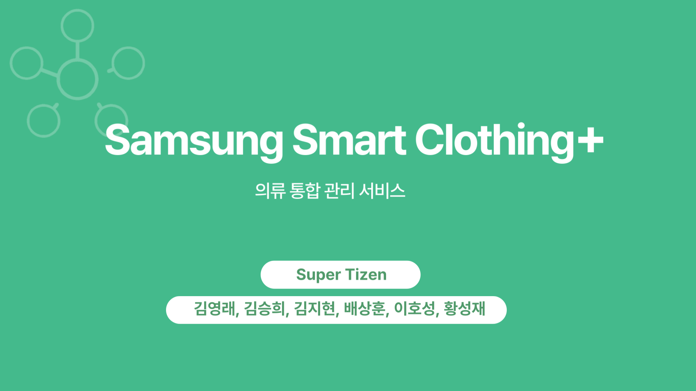

- [프로젝트 소개](#프로젝트-소개)
- [개발 기간](#개발-기간)
- [팀원](#팀원)
- [1. 개발 환경](#1-개발-환경)
- [2. 사용 기술](#2-사용-기술)
- [3. 아키텍처](#3-아키텍처)
- [4. 기능 소개](#4-기능-소개)
- [5. 개발 환경 구축](#5-개발-환경-구축)
- [6. 폴더 구조](#6-폴더-구조)

## 프로젝트 소개

- 모바일/머신러닝/에어드레서/세탁기를 모아 하나의 서비스로 제공합니다.
- 일정/날씨와 사용자의 정보에 따라 머신러닝을 통한 코디를 추천해 줍니다.
- 옷을 등록하거나, 옷의 상태에 따라 케어/세탁을 제안합니다.

## 개발 기간

2024.02.19 ~ 2024.04.01 (7주)

## 팀원

| 김영래                                                                           | 김승희                                                                            | 김지현                                                                           | 배상훈                                                                           | 이호성                                                                           | 황성재                                                                           |
| -------------------------------------------------------------------------------- | --------------------------------------------------------------------------------- | -------------------------------------------------------------------------------- | -------------------------------------------------------------------------------- | -------------------------------------------------------------------------------- | -------------------------------------------------------------------------------- |
|  |  |  |  |  |  |
| 팀장 / TIZEN                                                                     | mobile / FE                                                                       | Infra / BE                                                                       | ML / FE                                                                          | BE                                                                               | TIZEN                                                                            |

삼성청년 SW 아카데미 (통칭 SSAFY)에서 성적 우수자를 모집하여
삼성전자 DA사업부 전자 연계 프로젝트를 진행하였음.

<br>
<br>

## 1. 개발 환경

### [협업 도구]

- 이슈 관리 : Jira
- 형상 관리 : GitLab
- 커뮤니케이션 : Notion, MatterMost, Webex, Discord
- 디자인 : Figma
- CI/CI : Jenkins

### [개발 도구]

- Visual Studio Code
- IntelliJ : 2023.3.2
- Tizen Studio : 5.5

### [개발 환경]

**Backend**

- 언어 : Java 17
- JDK : 17.0.10
- 프레임워크 : Spring Boot 3.2.3
- 빌드 도구 : Gradle 8.6
- 패키징 : Jar

**Embedded**

- 운영 체제 : Tizen OS 8.0

**Frontend**

- 언어 : TypeScript 5.2.2
- 프레임워크 : React 18.2.0
- 패키지 관리자 : npm
- 빌드 도구 : vite 5.1.4

**Machine Learning**

- 언어 : Python 3.11.7
- 패키지 관리자 : pip 24.0
- 프레임워크 : Django 5.0.3

**Server**

- AWS EC2 Ubuntu

**Service**

- 데이터베이스 : Mysql 8.3.0
- NginX
- Jenkins
- Docker
- Ubuntu

환경 구축은 양이 많아 [8. 개발 환경 구축](#8-개발-환경-구축)에서 진행한다.

<br>
<br>

## 2. 사용 기술

### [EM - TIZEN]

- Tizen Navtice GUI (EFL, edc, edj)
- SDB
- I2C
- Sokcet

### [BE]

TODO

### [FE]

- Zustand를 통한 민첩한 상태 관리 체계 구축
- Swiper 및 React Calendar를 이용한 동적 인터페이스 구성
- Konva 및 React Konva로 그래픽 처리
- @tanstack/react-query로 데이터 캐싱 및 데이터 관리
- Vite Plugin PWA 및 Firebase SDK를 통한 PWA 지원
- TypeScript로 안정적인 코드 구현
- vite-tsconfig-paths를 통한 효율적인 모듈 관리 및 해석

### [ML]

- tensorflow를 통해 판단 MLP 모델의 keras파일 생성
- fine-tuning 기법을 통해 추가된 데이터 추가 학습
- open-cv를 통한 이미지 프로세싱
- scikit-image를 통해 이미지 유사도 벡터화
- scikit-learn의 KNN 모델을 통한 추천 옷 도출
- django-apscheduler을 이용하여 fine-tuning scheudle관리

<br>
<br>

## 3. 아키텍처

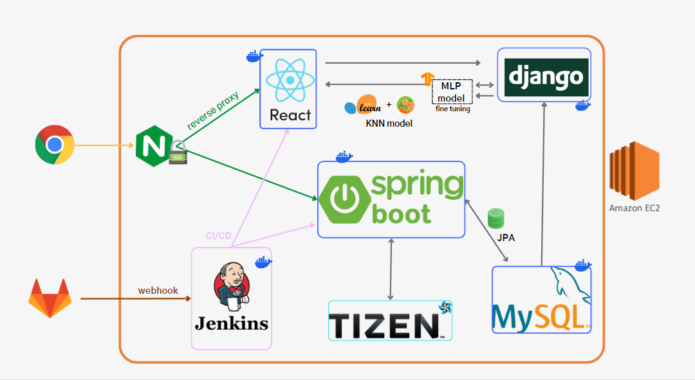

<br>
<br>

## 4. 기능 소개

### 모바일

|                                                    Home 화면 입는지                                                    |                                       내 옷장 보기                                       |                                                       옷 상세 보기                                                       |
| :--------------------------------------------------------------------------------------------------------------------: | :--------------------------------------------------------------------------------------: | :----------------------------------------------------------------------------------------------------------------------: |
|                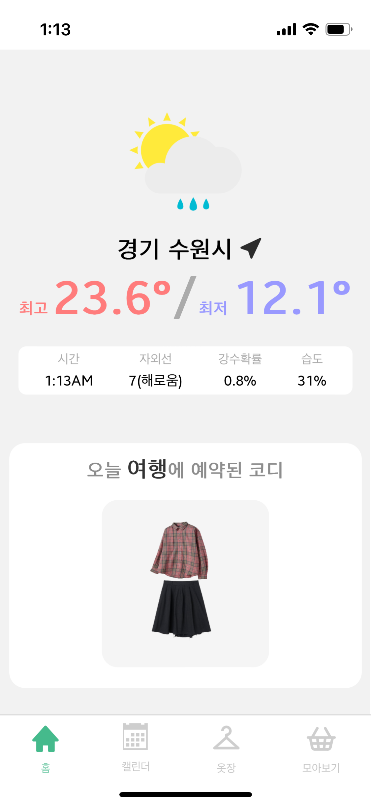                 | 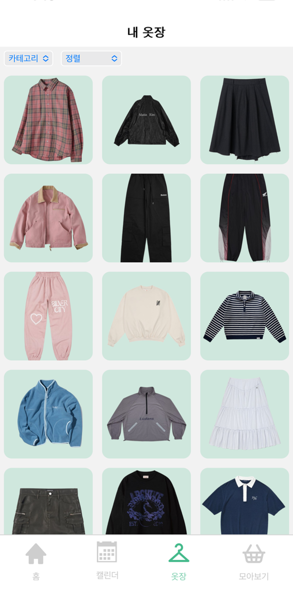 |                 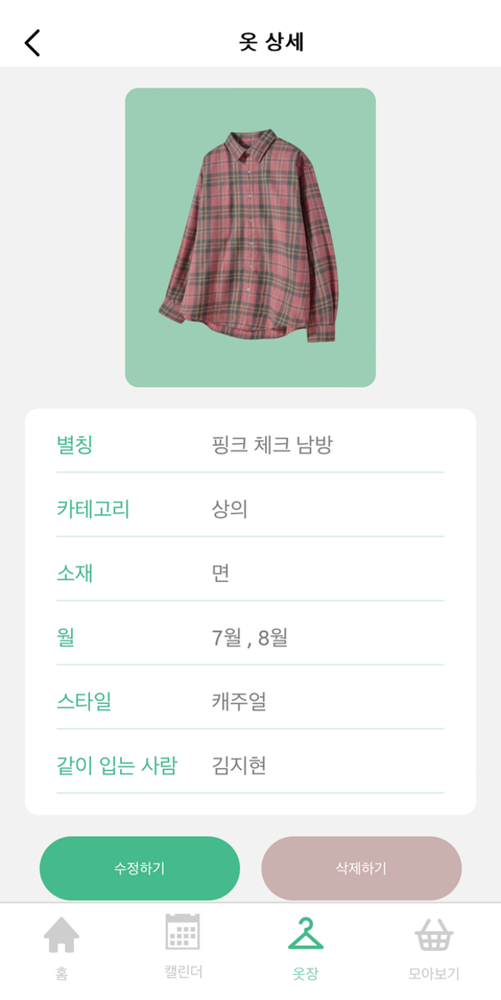                 |
| - 홈 화면을 보여준다.<br/>- 현재 위치의 날씨와 등록된 일정, 코디를 보여준다.<br/>- 하단의 바로 페이지 이동이 가능하다. |                                등록된 옷들을 볼 수 있다.                                 | - 옷의 상세 정보를 볼 수 있다.<br/>- 상세 정보는 별칭 / 카테고리 / 면/ 월(언제 입는지) / 스타일 / 같이 입는 사람이 있다. |

|                                                                                    옷 상세 정보 수정                                                                                    |                               캘린더                                |                                                                                                                                                                                     일정 등록                                                                                                                                                                                     |
| :-------------------------------------------------------------------------------------------------------------------------------------------------------------------------------------: | :-----------------------------------------------------------------: | :-------------------------------------------------------------------------------------------------------------------------------------------------------------------------------------------------------------------------------------------------------------------------------------------------------------------------------------------------------------------------------: |
|                                                           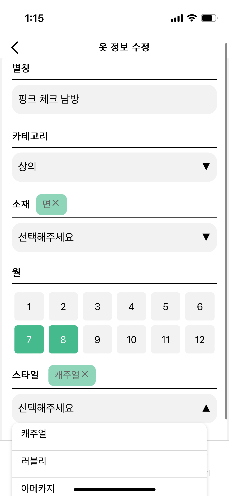                                                           | 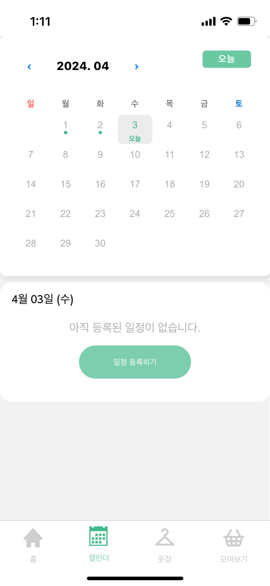 |                                                                                                                                                       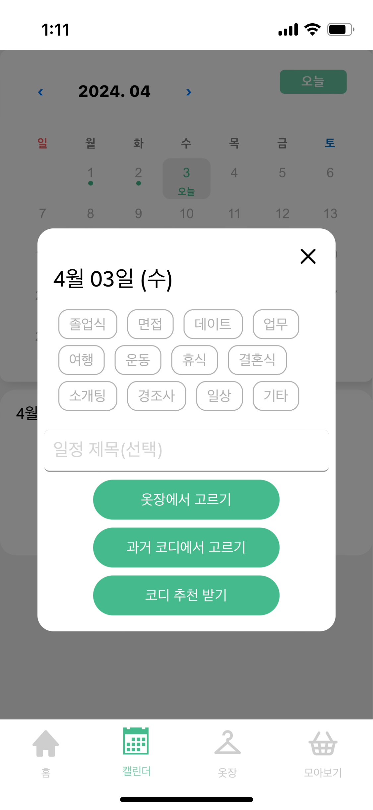                                                                                                                                                        |
| - 에어드레서에서 등록된 옷의 정보를 수정하는 기능이다.<br/>- 병칭 / 카테고리 / 소재 / 월(언제 입는지) / 스타일 / 같이 입는 사람을 수정할 수 있다.<br/>- 위 정보들은 AI 기술에 할용된다. |   - 캘린더를 구현하였다.<br/>- 해당 사진은 일정이 없는 경우이다.    | - 아래 버튼 3가지를 이용해 코디를 완성할 수 있다.<br/> - 옷장에서 고르기 : 사용자가 옷들이 등록된 옷장에서 직접 골라 코디를 완성한다.<br/> - 과거 코디에서 고르기 : 과거 사용자가 입었던 코디 목록들을 보거나, 가져와 코디를 완성한다.<br/> - 코디 추천 받기 : MLP/KNN으로 구현된 AI를 통해 일정/날씨/성별/연령 에 따라 코디를 추천 받는다. AI는 전체 사용자의 데이터로 학습된다. |

|                                                       옷장에서 코디 고르기                                                        |                        과거 코디에서 고르기                         |                                            코디 추천 받기                                            |
| :-------------------------------------------------------------------------------------------------------------------------------: | :-----------------------------------------------------------------: | :--------------------------------------------------------------------------------------------------: |
|                                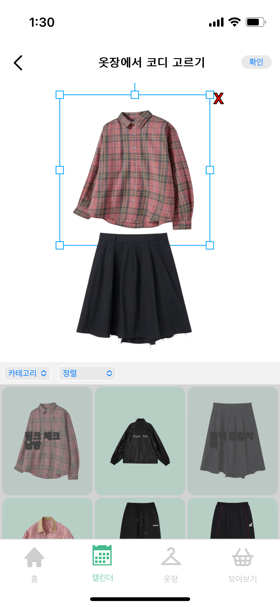                                |  |                                  |
| - 사용자의 옷을 바탕으로 코디를 직접 완성한다.<br/>- 상단 부분은 사용자가 드래그를 통해 코디의 미리보기 이미지를 만드는 기능이다. |            사용자의 코디 로그를 이용해 코디를 완성한다.             | 전체 사용자의 데이터를 기반으로 학습된 AI를 바탕으로 일정/날씨/성별/연령 에 따라 코디를 추천 받는다. |

|                          등록된 코디 확인                           |                                                            옷 상태 확인                                                            |                               모아보기                               |
| :-----------------------------------------------------------------: | :--------------------------------------------------------------------------------------------------------------------------------: | :------------------------------------------------------------------: |
| 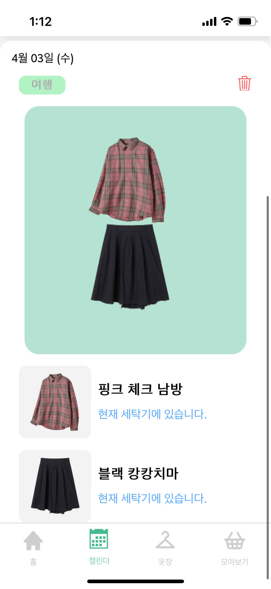 |                                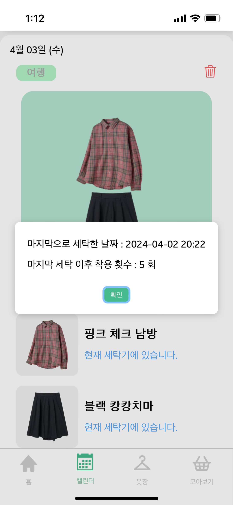                                 |  |
|                   일정과 코디가 등록된 경우이다.                    | - 위치에 대한 안내글을 클릭하면 다음과 같은 팝업이 나온다.<br/>- 마지막으로 세탁한 날짜와 마지막 세탁 이후 착용 횟수를 볼 수 있다. |        현재 세탁기나 에어드레서에 담긴 옷들을 확인 가능하다.         |

### 에어드레서

1. 옷 등록

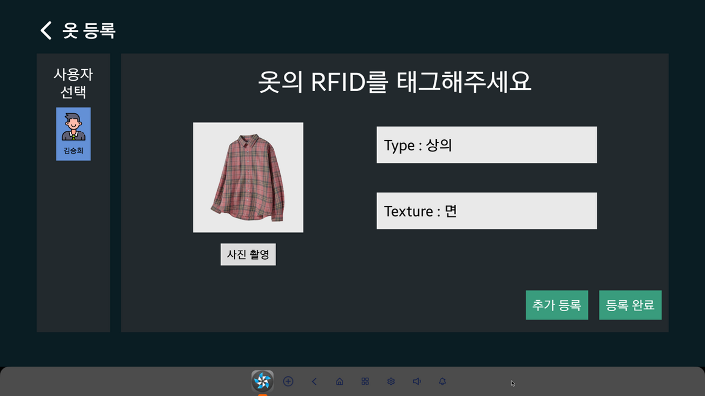

- SSF(실제로는 서버)로 부터 RFID를 통해 옷 정보를 가져온 후 등록한다.

### 세탁기

1. 세탁물 등록

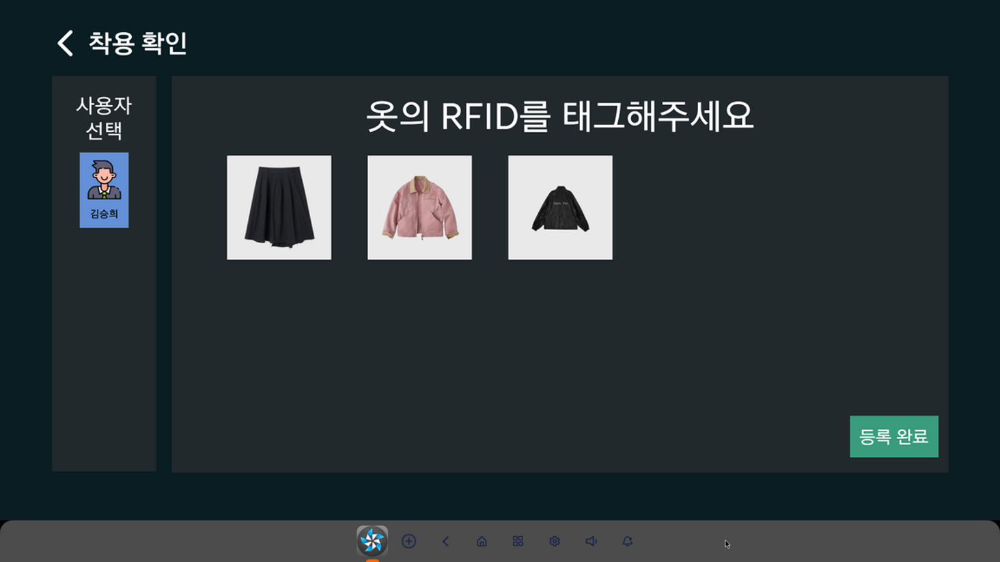

- 세탁기에 넣을 때 태깅을 하면 RFID를 통해 서버에 저장된 정보를 가져와 모바일과 연동 시킨다.

<br>
<br>

## 5. 개발 환경 구축

### Tizen

먼저, 아래 *필수 하드웨어*와 *필수 소프트웨어*가 필요하다.

_필수 하드웨어_
라즈베리파이 4B, 64GB 이상의 micro SD카드, SD카드 리더기, 라즈베리파이 LCD, 이더넷 케이블, 5V 충전기, C타입 충전 케이블

_필수 소프트웨어_
nmap, SDB(tizen studio 설치 시 자동설치)

_OS 설치_

tizen docs : https://docs.tizen.org/platform/developing/flashing-rpi/

1. 리눅스 환경 준비

   - tizen image를 sd카드에 flash하기 위해서는 linux 18.04 LTS 이상의 환경이 필요

   - WSL은 sd card 등의 device를 인식하지 못하므로 멀티부트를 통한 리눅스 환경이나 vm을 이용

     - vm 환경 세팅 방법

       virtualbox 홈페이지 → downloads : https://www.virtualbox.org/wiki/Downloads

       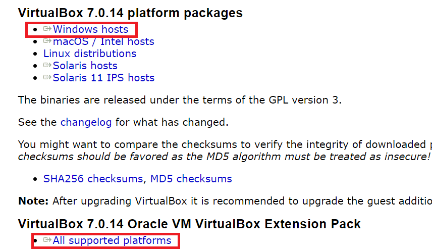

       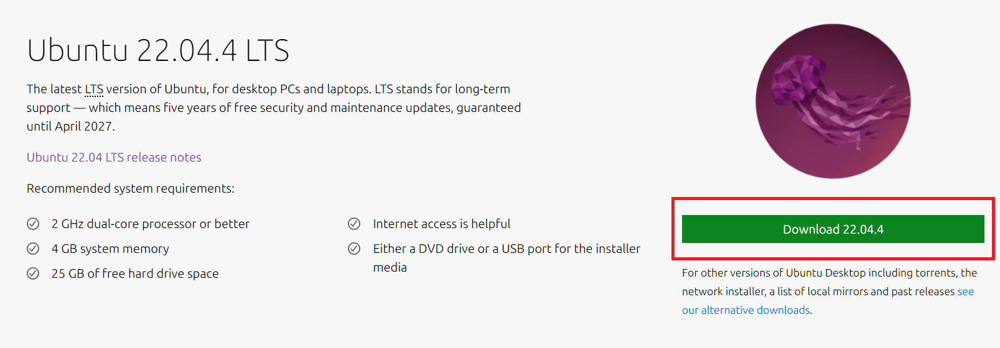

       - virtualbox 다운 프로그램 실행 후 iso를 이용하여 ubuntu 설치

       - extension pack도 설치

         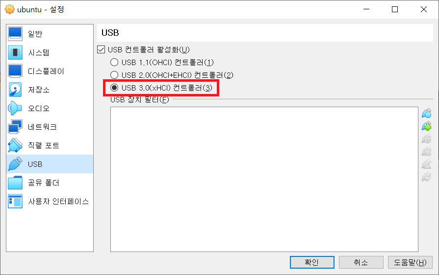

       - virtualbox에서 설정 → usb → usb 3.0 컨트롤러 선택 후 저장

         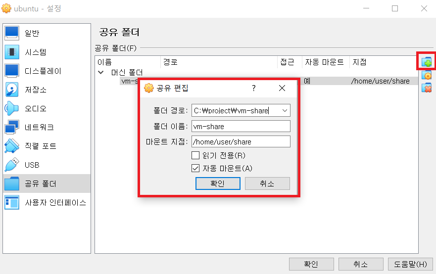

       - 설정 → 공유폴더 → 추가

       - 폴더 경로 : host 컴퓨터의 경로

       - 폴더 이름 : path 최종 directory name

       - 마운트 지점 : vm 내의 경로, /home/username/{원하는폴더이름}

       - vm 내에서 해당 폴더 명으로 직접 생성

       - 자동 마운트 체크

         ### sudo 권한 없을 때

         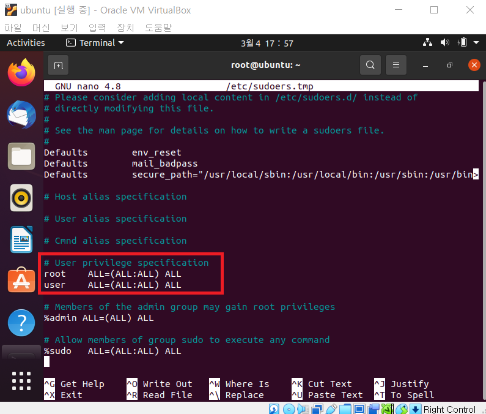

       - su root로 root 계정으로 접속 후 visudo /etc/sudoers

       - 해당 부분의 root 아래에 가상환경 유저 이름 ALL=(ALL:ALL) ALL 작성 및 저장

         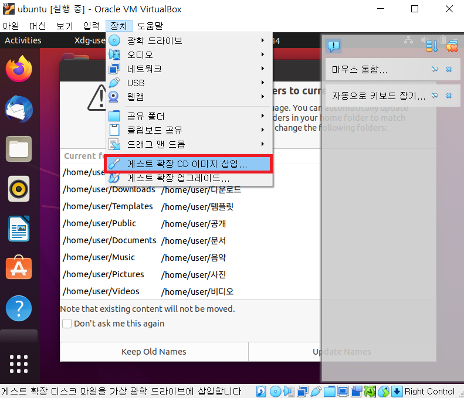

       - 게스트 확장 CD 이미지 삽입 → 설치 후 재부팅

       - 공유 폴더를 사용할 수 있게 된다

2. 바이너리 다운로드

   - 디스플레이가 없는 제품 개발 시 headless, 디스플레이가 있을 시 headed인 부팅, 플랫폼 이미지를 다운로드
   - vm 환경일 경우 호스트에서 다운받은 부팅 이미지를 공유폴더를 이용하여 복사

3. 이미지 Flash

   ```bash
   sudo apt-get install pv

   wget https://git.tizen.org/cgit/platform/kernel/u-boot/plain/scripts/tizen/sd_fusing_rpi3.sh?h=tizen --output-document=sd_fusing_rpi3.sh
   chmod 755 sd_fusing_rpi3.sh
   ```

   - pv 패키지 설치

   - rpi용 스크립트 설치(rpi3, rpi4는 동일)

   - SD 카드 장치 노드 확인

     ```bash
     ls -al /dev/sd*
     ```

     - SD 카드 삽입 전 상태 확인

     - SD 카드 삽입 후 동일한 명령어 실행하여 노드 확인

       ```bash
       # SD 카드 삽입 전
       brw-rw---- 1 root disk 8, 0  9 18 09:08 /dev/sda
       brw-rw---- 1 root disk 8, 1  9 18 09:08 /dev/sda1
       brw-rw---- 1 root disk 8, 2  9 18 09:08 /dev/sda2
       brw-rw---- 1 root disk 8, 5  9 18 09:08 /dev/sda5

       # SD 카드 삽입 후
       brw-rw---- 1 root disk 8, 0  9 18 09:08 /dev/sda
       brw-rw---- 1 root disk 8, 1  9 18 09:08 /dev/sda1
       brw-rw---- 1 root disk 8, 2  9 18 09:08 /dev/sda2
       brw-rw---- 1 root disk 8, 5  9 18 09:08 /dev/sda5
       brw-rw---- 1 root disk 8, 16  9 22 14:59 /dev/sdb
       brw-rw---- 1 root disk 8, 17  9 22 14:59 /dev/sdb1
       brw-rw---- 1 root disk 8, 18  9 22 14:59 /dev/sdb2
       brw-rw---- 1 root disk 8, 19  9 22 14:59 /dev/sdb3
       ```

     - 위와 같은 경우 SD카드의 노드는 /dev/sdb 가 된다.

   ```bash
   # 코드 양식
   sudo ./sd_fusing_rpi3.sh -d <SD card device node> --format
   sudo ./sd_fusing_rpi3.sh -d <SD card device node> -b <Boot Image path> <Platform Image path>

   # 예시
   sudo ./sd_fusing_rpi3.sh -d /dev/sdb --format
   sudo ./sd_fusing_rpi3.sh -d /dev/sdb -b tizen-unified_20221017.061100_tizen-boot-armv7l-rpi3.tar.gz tizen-unified_20221017.061100_tizen-headed-armv7l.tar.gz
   ```

   - 위의 양식에서 본인에게 해당하는 노드 번호, 부팅/플랫폼 파일을 입력한 후 실행
   - format 후 설치까지 진행됨

개발을 위해서는 SDB나 별도의 설정 필요

## PC - rasp(tizen) SDB 연결 및 wifi plug-in설치

### 1. SDB연결

1. nmap설치. 아래 사진들처럼 진행하여 nmap을 설치한다.

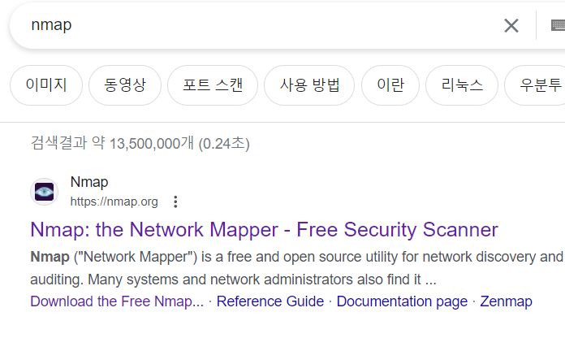

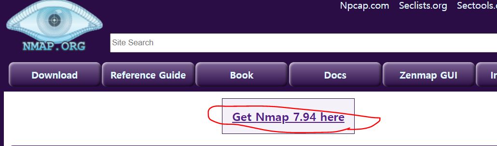

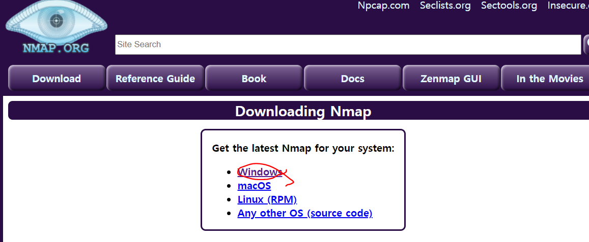

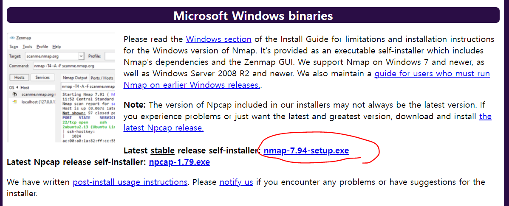

다운 받은 설치 파일을 설치한다.

1. 라즈베리파이와 노트북을 LAN선을 이용해 연결한다.

2. PC에서 인터넷 설정을 아래와 같이 진행한다.

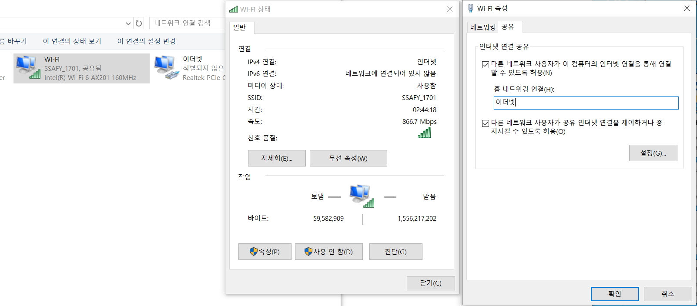

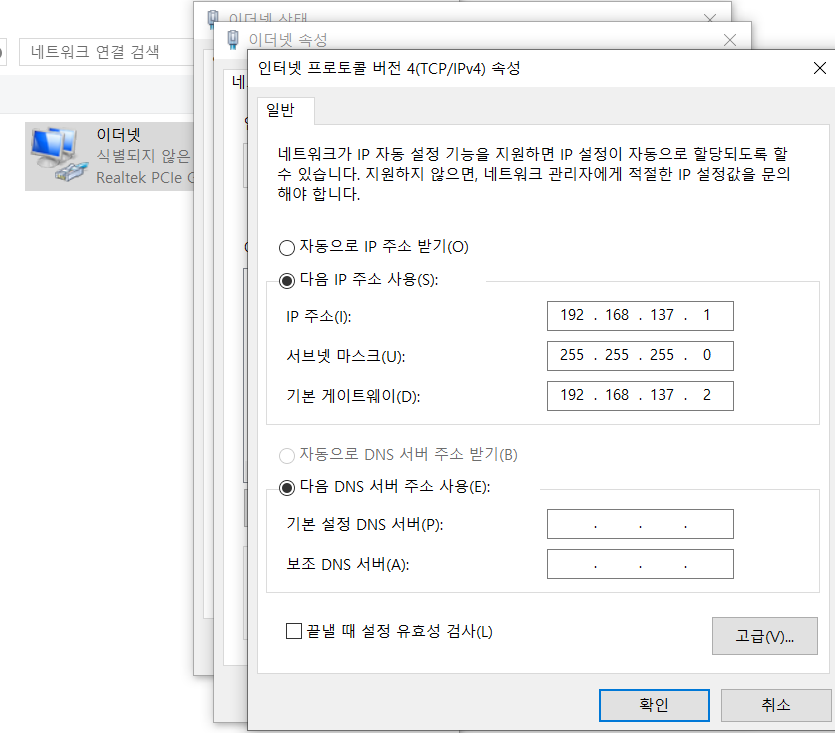

1. sdb.exe가 있는 위치에 명령 프롬프트 창을 연다.

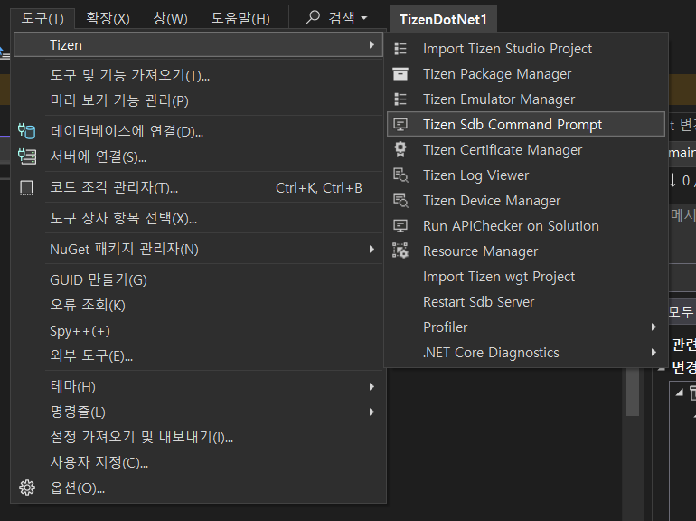

1. 윈도우 키 + R을 눌러서 cmd를 입력하고, cmd창을 연다.

nmap을 이용해 PC에서 라즈베리파이의 IP를 찾는다.

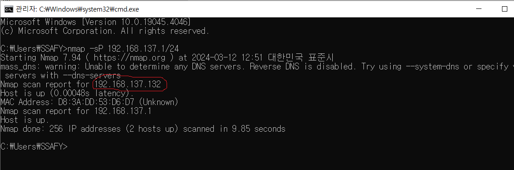

1. 찾은 IP를 기반으로 sdb연결을 한다.

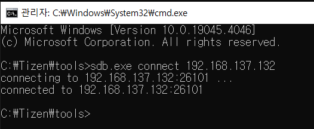

### 2. Wifi plug in 설치

참고자료

https://docs.tizen.org/iot/get-started/rpi3-5.0/

sdb명령어 모음

https://docs.tizen.org/application/tizen-studio/common-tools/smart-development-bridge/

tizen을 설치하고, wifi를 켜면 안 잡히는 문제가 있다.
이를 해결하기 위해 plug in을 sdb를 통해 설치해야한다.

1. 먼저 plug-in을 다운 받는다.

https://developer.samsung.com/tizen/TizenDeviceFirmware.html

회원가입을 필수로 진행해야 한다.

라즈베리파이에 설치한 Tizen버전에 맞는 plug-in을 설치 받는다.

(여기선 Tizen8.0을 설치했다)

1. sdb명령어를 통해 다운로드한 zip파일을 라즈베리파이로 옮긴다.

```bash
# 먼저 제한이 없게 root권한을 부여 받는다.
C:\Tizen\tools> sdb root on

# 다운로드 받은 폴더에서 cmd를 켜고, 라즈베리파이로 파일을 옮긴다.
C:\경로> sdb push [다운받은 파일] [라즈베리파이 경로]

#예시)  sdb push RPI3n4_plugin_tizen-8.0.zip /opt/usr/home/owner

# 타이젠의 shell로 이동, 이때 root: ~>가 떠야한다.
C:\경로> sdb shell
cd /opt/usr/home/owner
unzip RPI3n4_plugin_tizen-8.0.zip
cd RPI3n4_plugin_tizen-8.0
chmod 755 ./install_on_target.sh
install_on_target.sh
```

이제 라즈베리파이의 전원을 빼고, 다시 연결한다.

wifi가 정상 작동하는 것을 볼 수 있다.

### 만약, 다음날 nmap이 안 잡힌다면?

다시 랜을 연결하고 nmap을 통해 IP를 찾으면 192.168.137.1만 나올 수 있다.
이런 경우, 네트워크 설정을 다시 해주어야한다.

1. 네트워크 변경에서 WIFI를 클릭한다.
2. 속성 > 공유 >
3. 첫번째 박스인 “다른 네트워크 사용자~”를 해제하고 확인을 누른다.
4. 다시 속성 > 공유까지 진행한다.
5. 해제한 박스를 다시 활성화 한다. 이때 홈 네트워킹 연결은 이더넷으로 바꿔준다.
6. 네트워크 변경에서 이더넷을 클릭한다.
7. 속성 > 네트워킹 > TCP/IP4를 선택한다.
8. 게이트 웨이를 전과 동일하게 세팅한다.
9. 다시 nmap을 해보자

## App 포팅

1. Tizen studio에서 tizen project를 open

2. sdb로 raspberry pi에 연결

3. 프로젝트 우클릭 -> Run As -> Tizen Native Application

   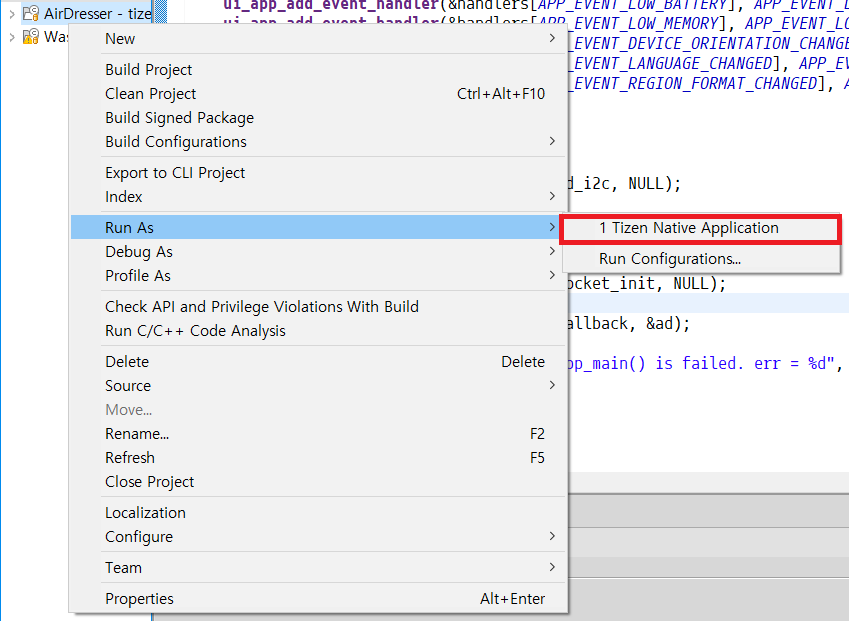

4. 설치 및 실행이 진행된다.

- 실행이나 설치가 되지 않을 경우 인증서 발급이 필요할 수 있다.

  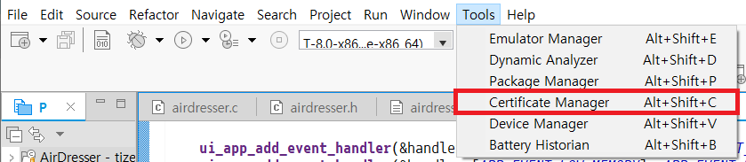

  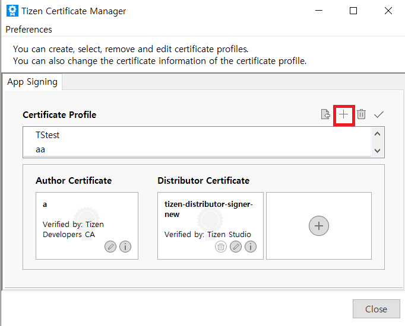

  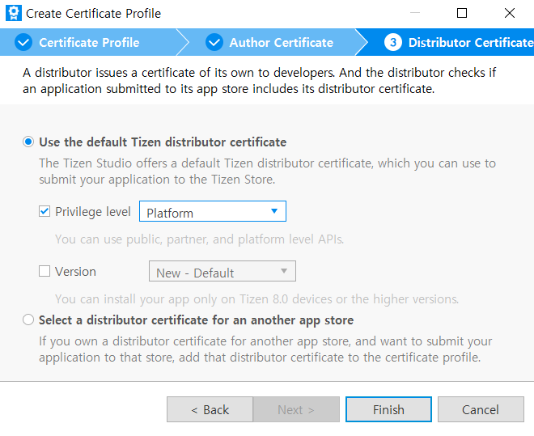

  발급 진행 중 해당 화면에서 Privilege level을 Platform으로 설정해야 peripheral이 가능하다.

  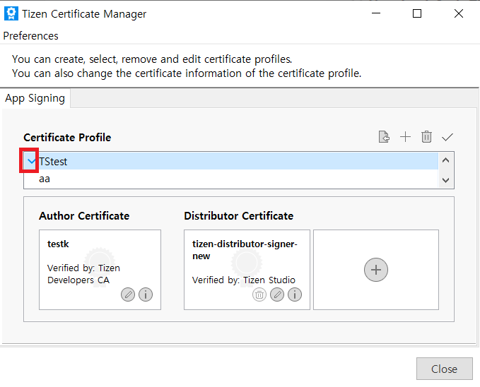

  발급 후 더블클릭으로 인증서를 선택하여 체크 표시 활성화 필요

# 6. 폴더 구조

```
├─.idea
├─BE
│  └─smartclothing
│      ├─gradle
│      │  └─wrapper
│      └─src
│          ├─main
│          │  ├─java
│          │  │  └─sueprtizen
│          │  │      └─smartclothing
│          │  │          ├─domain
│          │  │          │  ├─calendar
│          │  │          │  │  ├─controller
│          │  │          │  │  ├─dto
│          │  │          │  │  ├─entity
│          │  │          │  │  ├─exception
│          │  │          │  │  ├─repository
│          │  │          │  │  └─service
│          │  │          │  ├─clothing
│          │  │          │  │  ├─controller
│          │  │          │  │  ├─dto
│          │  │          │  │  ├─entity
│          │  │          │  │  ├─exception
│          │  │          │  │  ├─repository
│          │  │          │  │  └─service
│          │  │          │  ├─family
│          │  │          │  │  ├─controller
│          │  │          │  │  ├─entity
│          │  │          │  │  ├─exceprion
│          │  │          │  │  ├─repository
│          │  │          │  │  └─service
│          │  │          │  ├─location
│          │  │          │  │  ├─controller
│          │  │          │  │  ├─dto
│          │  │          │  │  ├─entity
│          │  │          │  │  ├─exception
│          │  │          │  │  ├─repository
│          │  │          │  │  └─service
│          │  │          │  ├─outfit
│          │  │          │  │  ├─past
│          │  │          │  │  │  ├─controller
│          │  │          │  │  │  ├─dto
│          │  │          │  │  │  ├─entity
│          │  │          │  │  │  ├─exception
│          │  │          │  │  │  ├─repository
│          │  │          │  │  │  └─service
│          │  │          │  │  └─recommended
│          │  │          │  │      ├─controller
│          │  │          │  │      ├─dto
│          │  │          │  │      ├─entity
│          │  │          │  │      ├─exception
│          │  │          │  │      ├─repository
│          │  │          │  │      └─service
│          │  │          │  ├─users
│          │  │          │  │  ├─controller
│          │  │          │  │  ├─dto
│          │  │          │  │  ├─entity
│          │  │          │  │  ├─exception
│          │  │          │  │  ├─repository
│          │  │          │  │  └─service
│          │  │          │  └─weather
│          │  │          │      ├─controller
│          │  │          │      ├─dto
│          │  │          │      ├─entity
│          │  │          │      ├─exception
│          │  │          │      ├─repository
│          │  │          │      └─service
│          │  │          ├─global
│          │  │          │  ├─config
│          │  │          │  ├─dto
│          │  │          │  ├─entity
│          │  │          │  ├─fcm
│          │  │          │  └─handler
│          │  │          └─socket
│          │  │              ├─clothes
│          │  │              │  ├─dto
│          │  │              │  ├─repository
│          │  │              │  └─service
│          │  │              ├─global
│          │  │              └─machine
│          │  │                  ├─dto
│          │  │                  ├─repository
│          │  │                  └─service
│          │  └─resources
│          │      └─firebase
│          └─test
│              └─java
│                  └─sueprtizen
│                      └─smartclothing
├─exec
├─FE
│  └─vite-project
│      ├─public
│  └─assets
│      ├─icons
│      └─screenshots
└─src
    ├─assets
    │  ├─ui
    │  └─weather
    ├─components
    ├─config
    ├─firebase
    ├─fonts
    ├─hooks
    ├─pages
    │  └─SmartThings
    ├─reducers
    ├─routes
    ├─sections
    │  ├─basket
    │  ├─calendar
    │  ├─closet
    │  ├─fix_current_clothes
    │  ├─today_info
    │  └─weather_location
    ├─store
    ├─styles
    └─types
        └─smartNavbarUi
├─img
│  ├─mobile
│  ├─profil
│  └─tizen
├─ML
│  └─machinelearning
│      ├─knn
│      │  └─migrations
│      ├─ML
│      └─mlp
│          ├─migrations
│          └─ML_models
│              ├─backup
│              └─current
└─TIZEN
    ├─AirDresser
    │  ├─.sign
    │  ├─inc
    │  ├─res
    │  │  └─contents
    │  │      └─edje_res
    │  ├─shared
    │  │  └─res
    │  └─src
    └─Washer
        ├─.sign
        ├─Debug
        │  ├─res
        │  │  └─contents
        │  │      └─edje_res
        │  └─src
        ├─inc
        ├─res
        │  └─contents
        │      └─edje_res
        ├─shared
        │  └─res
        └─src
```

Tizen

1. 빌드의 어려움 - *8. 개발 환경 구축*에서 해결
2. Camera preview 에러
3. peripheral 오류
4. Socket
5. Native기반 UI - style (edc/edj)
